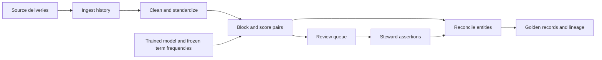

# Architecture

The engine turns source records into a maintained set of people and golden
records. Each source record has a stable `source_system:source_record_id` key;
each resolved entity has a separate persistent identifier.

## Pipeline and storage

| Stage | Work | Main outputs |
|---|---|---|
| Ingest | Map source columns, detect changed content and append versions | `raw_records`, `ingest_batches` |
| Standardize | Normalize values, select current records and generate blocking keys | `int_std_records`, `int_blocking_keys` |
| Train | Fit Splink parameters and freeze term-frequency lookups | `model_registry`, `tf_lookup`, model JSON in S3 |
| Match | Score candidates with a selected model and queue uncertain pairs | `match_scores`, `review_queue` |
| Reconcile | Apply assertions, cluster records and preserve entity identity | `entities`, `entity_membership`, `entity_events` |
| Assemble | Select winning values and record their source | `golden_records`, `golden_lineage`, `golden_display` |

DuckLake stores data in S3-compatible storage and metadata in PostgreSQL. DuckDB
executes SQL; dbt owns staging, standardization, blocking and golden models. Python
orchestrates ingestion, model lifecycle, reconciliation and operational writes.
File scans, hashing, score classification, affected-set discovery, overlap planning
and membership updates execute as SQL in DuckDB. Only documented compatibility,
ID-generation, serialization and graph operations process rows in Python; see
[Python processing exceptions](python-processing-exceptions.md).
Logical keys are enforced by writers and tests because DuckLake does not enforce
primary-key or unique constraints.

## Identity and golden records

An unchanged membership partition retains its entity ID. Merges select a survivor
and leave redirects for losing entities. Splits select the fragment that retains
the old ID and mint IDs for other fragments using deterministic ordering.
`entity_events` records the changes; identifiers alone are not a similarity score.

Golden values follow the configured survivorship ordering: validation, source
priority, recency, frequency or completeness. Address fields survive as one
component group. `golden_lineage` records the winning source and rule for each
attribute; `golden_display` is a presentation relation. Merged or retired entities
are removed from the current golden output.

## Incremental processing and review

Incremental matching scores new or changed records against the corpus and against
each other. Reconciliation expands the affected records to whole existing entities
and relevant current edges. Assembly rewrites the touched entities.

Scores depend on the chosen model and frozen term-frequency snapshot. Configuration
or model drift can require a full run. Incremental/full equivalence has explicit
preconditions; `er correct` refreshes term frequencies and performs a full rescore,
reconciliation and assembly without retraining. See
[INV-EQ](../DesignDoc.md#s4-5) for the precise guarantee.

Review decisions become persistent `always` or `never` assertions. Contradictory
assertions fail explicitly. The reconciliation policy enforces `never` constraints
across transitive connections, not just the directly scored pair.

## Execution boundaries

A PostgreSQL advisory lock permits one writer per tenant. Native DuckDB connections
are reused within a command and closed before dbt runs. `runs` and `run_stages`
record configuration fingerprints, status, counters and snapshot ranges. Failed
chains can resume from their first unfinished stage with the original configuration.

There is no serving API or built-in scheduler. An external scheduler invokes the
CLI, including periodic correction and maintenance. Coherence scoring currently
uses `NoopScorer`; the interface exists for a future implementation.

See the [runbook](runbook.md) for commands and the
[specification](../DesignDoc.md) for algorithms and schemas.
