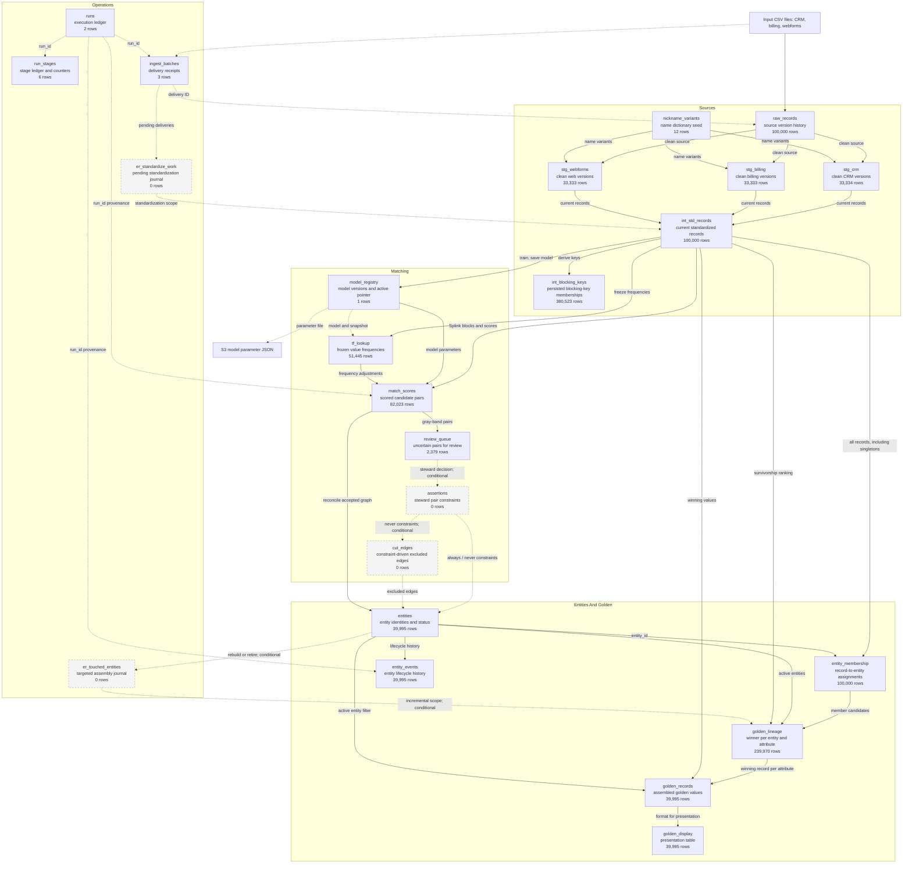
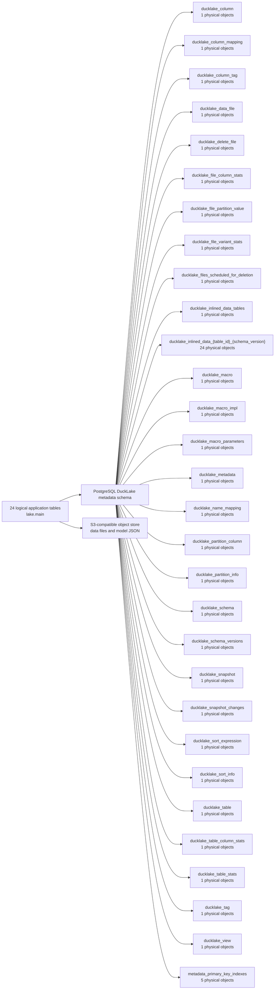

# Table relationships and pipeline catalog

This document follows source files through cleaning, matching, entity management
and golden-record assembly. It includes every persistent application table and
the runtime object families observed in the full 100,000-record audit.

The row counts and object inventories below are a snapshot measured on
**2026-09-23 UTC** at source commit
`41fb43706cb286c3aa378131cad1e3439d50e451`. This document preserves the measured
inventory and validation results. Counts will change with input data,
configuration and later runs; unexercised code paths are identified explicitly.

The audit completed ingestion, cleaning and standardization, training, full pair scoring, entity
reconciliation and golden assembly for all 100,000 input records.

The audited lake contained **24 application tables**, **0 application views**, **39,995 entities**
and **39,995 golden records**. All 204 explicit audit checks passed, as did 17 executed dbt data
tests. The Mermaid table set matched the observed catalog exactly.

Inputs contain 100,000 synthetic records generated from 40,000 personas, with seed 42, split across
CRM, billing and web forms. These are a measured resolution result, so the golden count need not
equal the persona count. Cluster precision was 96.388248%, recall 99.243750%, and F1 97.795159%.
Edge precision was 99.055798%, recall 99.045849%.

Additional read-only checks found no noncanonical names, invalid stored email/phone formats, or
duplicate nickname pairs. Comparing raw strings with standardized values found 5,719 changed email
values and 75,360 changed phone values; name casing/normalization changed all 100,000 given and
family names. Counts include null normalization.

**How a file becomes a golden record**

1. `er init` creates the 15 operational/history tables. The generator writes the three CSV
   deliveries and a separate truth file used for validation.
2. `er ingest` maps and hashes each delivery in `er_ingest_delivery`, appends source versions to
   `raw_records`, records `ingest_batches`, and queues standardization work.
3. `er standardize` runs dbt: three staging tables normalize names, emails, phone numbers, addresses
   and dates. The nickname seed enriches a separate matching feature. `int_std_records` selects the
   current nondeleted version per source record; `int_blocking_keys` materializes configured key
   memberships.
4. `er train` estimates the Splink model from standardized records, saves its parameter JSON to S3,
   records the model version, and freezes frequencies in `tf_lookup`.
5. `er match --mode full` uses the standardized corpus, trained model and frozen frequencies to
   block and score candidate pairs. This run generated 137,475 candidates, persisted 82,023 scores
   at or above the 0.60 review threshold, and accepted 79,644 pairs at or above the 0.95 auto-merge
   threshold; 2,379 gray-band pairs entered review. Splink constructs its own candidate SQL from the
   configuration; it does not read `int_blocking_keys` for scoring.
6. `er reconcile` forms connected components from accepted edges while respecting assertions and cut
   edges. All records receive membership, including singletons. It writes stable entity identities
   and lifecycle events.
7. `er assemble` selects a winning member for each survivable attribute, records six lineage
   decisions per entity, and builds golden values and their display table. The six address fields
   share one winning member.

**Nickname matching and source values**

The [`nickname_variants` seed](../dbt/seeds/nickname_variants.csv) contains 12
name pairs. The [standardization macro](../dbt/macros/std/name_variants.sql)
uses those pairs to build a separate `name_variants` array. For example, a source
name `Bob` becomes `given_name = 'bob'` and
`name_variants = ['bob', 'robert']`. The nickname seed does not replace the
source name with a different name.

The configured `variant_match` comparison treats an overlapping variant as one
piece of matching evidence alongside the other fields. Golden-record assembly
reads the standardized name from the winning source record. The dictionary is a
chosen matching feature, not a requirement of dbt or golden-record assembly;
removing it would require changing the staging dependency and matching
configuration, then measuring the effect on matching quality.

**Persistent table diagram**

All table nodes represent persistent relations in the `lake.main` namespace. Solid arrows show data
dependencies; dotted arrows show operational/logical associations or conditional paths.
Relationships are checked by writers/tests rather than enforced foreign keys. Gray nodes are
existing tables with zero rows.



**Every persistent application table**

| Table | Rows | Created after | Meaning |
|---|---:|---|---|
| `raw_records` | 100,000 | 01-init | Append-only source payload versions, content hashes, deletion flags and delivery IDs. |
| `ingest_batches` | 3 | 01-init | One receipt per ingested source delivery, with input and outcome counts. |
| `stg_crm` | 33,334 | 05-standardize | Cleaned CRM record versions using the common standardized column layout. |
| `stg_billing` | 33,333 | 05-standardize | Cleaned billing record versions using the common standardized column layout. |
| `stg_webforms` | 33,333 | 05-standardize | Cleaned web-form record versions using the common standardized column layout. |
| `nickname_variants` | 12 | 05-standardize | Seed name pairs used to expand the matching feature; the source still supplies `given_name`. |
| `int_std_records` | 100,000 | 05-standardize | Current, nondeleted standardized record for each source record_key. |
| `int_blocking_keys` | 380,523 | 05-standardize | Persisted key memberships per standardized record; a companion output of standardization. |
| `model_registry` | 1 | 01-init | Trained model versions, active status, S3 parameter file and frozen TF snapshot. |
| `tf_lookup` | 51,445 | 01-init | Frozen value frequencies by model, snapshot and comparison column. |
| `match_scores` | 82,023 | 01-init | Stored scored candidate pairs with probability, evidence, model/TF versions and validity. |
| `review_queue` | 2,379 | 01-init | Pairs or entities awaiting review; this run can create gray-band pair reviews. |
| `assertions` | 0 | 01-init | Steward always/never pair decisions that constrain reconciliation; empty on this initial load. |
| `cut_edges` | 0 | 01-init | Edges removed to satisfy never constraints; empty without those constraints. |
| `entities` | 39,995 | 01-init | Stable entity IDs, lifecycle status and merge redirects. |
| `entity_membership` | 100,000 | 01-init | Current assignment of every source record to an entity. |
| `entity_events` | 39,995 | 01-init | Entity lifecycle history; this initial load records entity creation events. |
| `golden_lineage` | 239,970 | 09-assemble | Winning source record and survivorship rule per entity and attribute; address is one group. |
| `golden_records` | 39,995 | 09-assemble | One assembled golden record per active entity, using the selected winning values. |
| `golden_display` | 39,995 | 09-assemble | Presentation-ready golden output; physically a table despite its display role. |
| `runs` | 2 | 01-init | Run IDs, configuration/model fingerprints, mode and overall execution status. |
| `run_stages` | 6 | 01-init | Stage status, timing, counters and DuckLake snapshot boundaries for each run. |
| `er_standardize_work` | 0 | 01-init | Persistent delivery work journal consumed and cleared by standardization. |
| `er_touched_entities` | 0 | 01-init | Persistent entity work journal for targeted rebuild/retirement; initial assembly uses all active entities. |

The run ledger has two run IDs: the main data pipeline and training. The three source-ingest
invocations reuse the same run/stage row, so `run_stages` retains the last ingest counters. All
three delivery receipts remain in `ingest_batches`, and all nine ER command invocations (including
initialization) are retained in the command logs and stage-catalog snapshots.

The [table registry](../src/er/lake/model.py) defines schemas, types and nullability for 23
application tables; the [seed CSV](../dbt/seeds/nickname_variants.csv) defines the remaining table's
`variant_a` and `variant_b` columns. The registry also defines ownership and logical keys.
No persistent application indexes,
sequences or user-defined catalog functions/macros were created. dbt macros compile SQL and are not
themselves persisted database macros.

**Keys used to connect the tables**

These are logical joins. DuckLake does not enforce primary-key, unique or
foreign-key constraints. Writers and data tests maintain these relationships.
The registry contains the complete logical-key definitions.

| Relationship | Join / key | Meaning |
|---|---|---|
| `ingest_batches` → `raw_records` | `ingest_batch_id` | Delivery that introduced a source version |
| `raw_records` → each `stg_*` → `int_std_records` | `source_system`, `source_record_id`, `content_hash` | Preserve version provenance through cleaning and current-record selection |
| `int_std_records` → `int_blocking_keys` | `record_key` | Blocking-key memberships for a source record |
| `int_std_records` → `match_scores` | `record_key` equals `rec_a_key` or `rec_b_key` | The two records compared in a candidate pair |
| `model_registry` / `tf_lookup` → `match_scores` | `model_version`, `tf_snapshot_id` | Model and frozen frequency snapshot used to score the pair |
| `int_std_records` → `entity_membership` | `record_key` | Current entity assignment for each source record |
| `entities` → `entity_membership`, `entity_events`, golden tables | `entity_id` | Persistent identity, its members, its history and its current output |
| `entities` → `entities` | `merged_into` points to the survivor's `entity_id` | Redirect after a merge; not exercised in this initial run |
| `golden_lineage` → `int_std_records` | `record_key`; lineage key is (`entity_id`, `attribute`) | Source record that won each golden attribute |
| `golden_records` → `golden_display` | `entity_id` | Presentation of the same current golden record |
| `runs` → operational writes | `run_id` and creation/update run IDs | Execution provenance; `run_stages` records each run's stages |

`record_key` is `source_system || ':' || source_record_id`. A source record has
one current membership; an entity can have many source records. The six lineage
attributes are `given_name`, `family_name`, `email`, `phone_e164`, `birth_date`
and `address`. The `address` winner supplies all six `addr_*` columns together.

**Catalog growth and checks**

| Completed command | Persistent tables | Newly created tables |
|---|---:|---|
| 01-init | 15 | assertions, cut_edges, entities, entity_events, entity_membership, er_standardize_work, er_touched_entities, ingest_batches, match_scores, model_registry, raw_records, review_queue, run_stages, runs, tf_lookup |
| 02-ingest | 15 | None |
| 03-ingest | 15 | None |
| 04-ingest | 15 | None |
| 05-standardize | 21 | int_blocking_keys, int_std_records, nickname_variants, stg_billing, stg_crm, stg_webforms |
| 06-train | 21 | None |
| 07-match | 21 | None |
| 08-reconcile | 21 | None |
| 09-assemble | 24 | golden_display, golden_lineage, golden_records |

The 204 checks verify expected table/column contracts, required values, logical uniqueness, model/TF
references, pair ordering, record-to-entity coverage, active-entity/golden/display coverage, and
equality between every golden value and its recorded winning source. All 100,000 standardized
records have exactly one membership. There are 239,970 lineage rows, exactly six per golden record.
There are no unexpected persisted scratch objects.

The audit also checked all 17
dbt model dependencies against diagram edges, each of the 28 observed runtime families against
runtime diagram nodes, and the 15 → 21 → 24 table creation sequence. Every target of the 178
recorded successful CREATE TABLE/VIEW statements was observed in a catalog. This validates object
coverage and the observed initial-run relationships; conditional lifecycle paths remain unexercised.

**Temporary and in-memory objects**

These disappear with their owning connection. Tables in `memory.splink_scratch` or `memory.main` are
connection-local even where DuckDB does not label them SQL TEMP. `temp.main` contains explicit
temporary tables and views. Names with `{id}` group generated suffixes; the inventory below
records each family, scope, purpose and observed version count. Exact per-connection traces
remain in the local audit artifacts. Versions
include replacement iterations, not only unique names.

```mermaid
flowchart TB
  s0["assemble"]
  s1["ingest"]
  s2["init"]
  s3["match"]
  s4["reconcile"]
  s5["standardize"]
  s6["train"]
  s7["validation/connection"]
  r0["__splink__aggregated_m_u_counts_{id}<br/>view: temp.main<br/>6 observed versions"]
  s6 --> r0
  r1["__splink__blocked_id_pairs_{id}<br/>table: memory.splink_scratch<br/>3 observed versions"]
  s3 --> r1
  s6 --> r1
  r2["__splink__cumulative_blocking_rule_counts<br/>view: temp.main<br/>1 observed versions"]
  s6 --> r2
  r3["__splink__df_blocking_rule_counts<br/>table: memory.splink_scratch<br/>1 observed versions"]
  s6 --> r3
  r4["__splink__df_comparison_vectors_{id}<br/>table: memory.splink_scratch<br/>2 observed versions"]
  s6 --> r4
  r5["__splink__df_concat_count_{id}<br/>table: memory.splink_scratch<br/>1 observed versions"]
  s6 --> r5
  r6["__splink__df_concat_sample_{id}<br/>table: memory.splink_scratch<br/>1 observed versions"]
  s6 --> r6
  r7["__splink__df_count_cumulative_blocks_{id}<br/>table: memory.splink_scratch<br/>1 observed versions"]
  s6 --> r7
  r8["__splink__df_count_{id}<br/>table: memory.splink_scratch<br/>1 observed versions"]
  s6 --> r8
  r9["__splink__df_predict_{id}<br/>table: memory.splink_scratch<br/>1 observed versions"]
  s3 --> r9
  r10["__splink__df_tf_email_{id}<br/>table: memory.splink_scratch<br/>1 observed versions"]
  s6 --> r10
  r11["__splink__df_tf_family_name_{id}<br/>table: memory.splink_scratch<br/>1 observed versions"]
  s6 --> r11
  r12["__splink__df_tf_given_name_{id}<br/>table: memory.splink_scratch<br/>1 observed versions"]
  s6 --> r12
  r13["__splink__m_u_counts_{id}<br/>table: memory.splink_scratch<br/>74 observed versions"]
  s6 --> r13
  r14["benchmark_truth_{id}<br/>table: temp.main<br/>1 observed versions"]
  s7 --> r14
  r15["er_bulk_{id}<br/>table: temp.main<br/>36 observed versions"]
  s1 --> r15
  s3 --> r15
  s4 --> r15
  s7 --> r15
  r16["er_frozen_tf_{id}<br/>table: temp.main<br/>3 observed versions"]
  s3 --> r16
  r17["er_ingest_delivery<br/>table: temp.main<br/>3 observed versions"]
  s1 --> r17
  r18["er_initial_edges_{id}<br/>view: temp.main<br/>1 observed versions"]
  s4 --> r18
  r19["er_label_prop_adjacency<br/>table: temp.main<br/>1 observed versions"]
  s4 --> r19
  r20["er_label_prop_labels<br/>table: temp.main<br/>6 observed versions"]
  s4 --> r20
  r21["er_label_prop_next<br/>table: temp.main<br/>6 observed versions"]
  s4 --> r21
  r22["er_match_corpus<br/>table: memory.splink_scratch<br/>1 observed versions"]
  s3 --> r22
  r23["er_match_stage_{id}<br/>table: temp.main<br/>5 observed versions"]
  s3 --> r23
  r24["er_train_corpus<br/>table: memory.main<br/>1 observed versions"]
  s6 --> r24
  r25["er_train_u_sample<br/>table: memory.splink_scratch<br/>1 observed versions"]
  s6 --> r25
  r26["result_df<br/>view: temp.main<br/>1 observed versions"]
  s6 --> r26
  r27["splink_scratch<br/>schema: memory.splink_scratch<br/>32 observed versions"]
  s0 --> r27
  s1 --> r27
  s2 --> r27
  s3 --> r27
  s4 --> r27
  s5 --> r27
  s6 --> r27
  s7 --> r27
  subgraph conditional["Other code paths: not observed in this initial full load"]
    c0["er_match_batch_keys<br/>incremental matching changed-record keys"]:::conditional
    c1["er_match_batch<br/>incremental matching new/changed records"]:::conditional
    c2["er_match_prior_corpus<br/>incremental matching existing corpus"]:::conditional
    c3["er_match_incremental_pairs<br/>union of incremental scoring branches"]:::conditional
    c4["er_affected_edges_{id}<br/>affected-subgraph reconciliation on an existing entity population"]:::conditional
    c5["er_current_edges<br/>default current-edge helper view; initial reconciliation uses a unique initial-edge view"]:::conditional
    c6["er_cluster_nodes<br/>alternate cluster helper path"]:::conditional
    c7["er_cluster_edges<br/>alternate cluster helper path"]:::conditional
  end
  classDef conditional fill:#f4f4f4,stroke:#888,stroke-dasharray:5 5
```



| Family | Kind / scope | Versions | Stages | Meaning |
|---|---|---:|---|---|
| `__splink__aggregated_m_u_counts_{id}` | view / `temp.main` | 6 | train | Registered view combining training parameter estimates. |
| `__splink__blocked_id_pairs_{id}` | table / `memory.splink_scratch` | 3 | match, train | Candidate pairs emitted by Splink blocking rules. |
| `__splink__cumulative_blocking_rule_counts` | view / `temp.main` | 1 | train | Splink training/blocking/count/sample intermediate. |
| `__splink__df_blocking_rule_counts` | table / `memory.splink_scratch` | 1 | train | Splink training/blocking/count/sample intermediate. |
| `__splink__df_comparison_vectors_{id}` | table / `memory.splink_scratch` | 2 | train | Comparison-level values for candidate pairs. |
| `__splink__df_concat_count_{id}` | table / `memory.splink_scratch` | 1 | train | Splink training/blocking/count/sample intermediate. |
| `__splink__df_concat_sample_{id}` | table / `memory.splink_scratch` | 1 | train | Splink training/blocking/count/sample intermediate. |
| `__splink__df_count_cumulative_blocks_{id}` | table / `memory.splink_scratch` | 1 | train | Splink training/blocking/count/sample intermediate. |
| `__splink__df_count_{id}` | table / `memory.splink_scratch` | 1 | train | Splink training/blocking/count/sample intermediate. |
| `__splink__df_predict_{id}` | table / `memory.splink_scratch` | 1 | match | Scored Splink prediction output before persistence. |
| `__splink__df_tf_email_{id}` | table / `memory.splink_scratch` | 1 | train | Splink term-frequency lookup intermediate. |
| `__splink__df_tf_family_name_{id}` | table / `memory.splink_scratch` | 1 | train | Splink term-frequency lookup intermediate. |
| `__splink__df_tf_given_name_{id}` | table / `memory.splink_scratch` | 1 | train | Splink term-frequency lookup intermediate. |
| `__splink__m_u_counts_{id}` | table / `memory.splink_scratch` | 74 | train | Training counts for estimating match/nonmatch probabilities. |
| `benchmark_truth_{id}` | table / `temp.main` | 1 | validation/connection | Synthetic ground truth loaded only for benchmark quality validation. |
| `er_bulk_{id}` | table / `temp.main` | 36 | ingest, match, reconcile, validation/connection | SQL/bulk staging for operational and reconciliation writes. |
| `er_frozen_tf_{id}` | table / `temp.main` | 3 | match | Per-column frozen TF data registered with Splink. |
| `er_ingest_delivery` | table / `temp.main` | 3 | ingest | Scanned input delivery, mapped and hashed before persistence. |
| `er_initial_edges_{id}` | view / `temp.main` | 1 | reconcile | Current accepted edges for initial reconciliation. |
| `er_label_prop_adjacency` | table / `temp.main` | 1 | reconcile | Bidirectional accepted-edge adjacency for clustering. |
| `er_label_prop_labels` | table / `temp.main` | 6 | reconcile | Current component label per record, including singletons. |
| `er_label_prop_next` | table / `temp.main` | 6 | reconcile | Next label-propagation iteration. |
| `er_match_corpus` | table / `memory.splink_scratch` | 1 | match | Full standardized corpus supplied to Splink prediction. |
| `er_match_stage_{id}` | table / `temp.main` | 5 | match | Scoring classification and persistence staging. |
| `er_train_corpus` | table / `memory.main` | 1 | train | Training projection of standardized records. |
| `er_train_u_sample` | table / `memory.splink_scratch` | 1 | train | Training sample for nonmatch probability estimation. |
| `result_df` | view / `temp.main` | 1 | train | Registered training helper view. |
| `splink_scratch` | schema / `memory.splink_scratch` | 32 | assemble, ingest, init, match, reconcile, standardize, train, validation/connection | In-memory schema containing Splink intermediates. |

Observed 60 connections with no catalog-observer errors. Splink made 6 handled attempts to `DROP
TABLE` names registered as views; these are recorded cleanup fallbacks, and training completed
successfully.

The initial run does not exercise incremental batch tables, affected-subgraph reconciliation,
steward decisions or the alternate cluster helper. `er_initial_edges_{id}` was observed; the default
helper name `er_current_edges` was not used in this path. Benchmark truth staging is a validation
object. SQL CTEs such as `__splink__df_concat` are query-local expressions and are not extra catalog
tables.

**DuckLake storage and engine objects**

DuckDB runs in memory and attaches DuckLake as `lake`; there is no standalone `.duckdb` file holding
this result. PostgreSQL stores DuckLake metadata and inline data, while larger data files and the
trained model live in the isolated S3-compatible object store. The 24 application tables are logical
DuckLake relations, not 24 ordinary PostgreSQL business tables.

Within the measured PostgreSQL namespace `profile_4ba44efe105246099e77f7eea30b48fe`, the catalog
contains 52 physical tables and 5 indexes. The full list follows. DuckLake inlined tables correspond
to logical relation storage; they are implementation objects rather than additional pipeline
outputs.

The storage diagram groups physical objects by catalog family. Its arrows show
which layer owns the objects, rather than SQL foreign keys. The physical
inventory below lists every PostgreSQL object and maps each inline store to its
application table. That mapping was queried from PostgreSQL and covers all 24
application tables.



In the physical inventory, `r` means table and `i` means index. Physical inline
row counts can include historical versions and are not the same as current
logical application-table counts; larger data may reside in object-store files.


| PostgreSQL object | Kind | Rows | Meaning |
|---|---|---:|---|
| `ducklake_data_file_pkey` | i | — | DuckLake metadata primary-key index. |
| `ducklake_delete_file_pkey` | i | — | DuckLake metadata primary-key index. |
| `ducklake_schema_pkey` | i | — | DuckLake metadata primary-key index. |
| `ducklake_snapshot_changes_pkey` | i | — | DuckLake metadata primary-key index. |
| `ducklake_snapshot_pkey` | i | — | DuckLake metadata primary-key index. |
| `ducklake_column` | r | 272 | DuckLake column metadata. |
| `ducklake_column_mapping` | r | 0 | DuckLake column mapping metadata. |
| `ducklake_column_tag` | r | 0 | DuckLake column tag metadata. |
| `ducklake_data_file` | r | 18 | DuckLake data file metadata. |
| `ducklake_delete_file` | r | 0 | DuckLake delete file metadata. |
| `ducklake_file_column_stats` | r | 196 | DuckLake file column stats metadata. |
| `ducklake_file_partition_value` | r | 0 | DuckLake file partition value metadata. |
| `ducklake_file_variant_stats` | r | 0 | DuckLake file variant stats metadata. |
| `ducklake_files_scheduled_for_deletion` | r | 0 | DuckLake files scheduled for deletion metadata. |
| `ducklake_inlined_data_10_10` | r | 0 | Inline row storage for lake.main.cut_edges. |
| `ducklake_inlined_data_11_11` | r | 16 | Inline row storage for lake.main.runs. |
| `ducklake_inlined_data_12_12` | r | 16 | Inline row storage for lake.main.run_stages. |
| `ducklake_inlined_data_13_13` | r | 3 | Inline row storage for lake.main.ingest_batches. |
| `ducklake_inlined_data_14_14` | r | 3 | Inline row storage for lake.main.er_standardize_work. |
| `ducklake_inlined_data_15_15` | r | 0 | Inline row storage for lake.main.er_touched_entities. |
| `ducklake_inlined_data_16_16` | r | 0 | Inline row storage for lake.main.nickname_variants. |
| `ducklake_inlined_data_17_17` | r | 0 | Inline row storage for lake.main.stg_billing. |
| `ducklake_inlined_data_18_18` | r | 0 | Inline row storage for lake.main.stg_crm. |
| `ducklake_inlined_data_19_19` | r | 0 | Inline row storage for lake.main.stg_webforms. |
| `ducklake_inlined_data_1_1` | r | 0 | Inline row storage for lake.main.raw_records. |
| `ducklake_inlined_data_20_20` | r | 0 | Inline row storage for lake.main.int_std_records. |
| `ducklake_inlined_data_21_21` | r | 0 | Inline row storage for lake.main.int_blocking_keys. |
| `ducklake_inlined_data_22_22` | r | 0 | Inline row storage for lake.main.golden_lineage. |
| `ducklake_inlined_data_23_23` | r | 0 | Inline row storage for lake.main.golden_records. |
| `ducklake_inlined_data_24_24` | r | 0 | Inline row storage for lake.main.golden_display. |
| `ducklake_inlined_data_2_2` | r | 0 | Inline row storage for lake.main.match_scores. |
| `ducklake_inlined_data_3_3` | r | 0 | Inline row storage for lake.main.entity_membership. |
| `ducklake_inlined_data_4_4` | r | 0 | Inline row storage for lake.main.entities. |
| `ducklake_inlined_data_5_5` | r | 0 | Inline row storage for lake.main.entity_events. |
| `ducklake_inlined_data_6_6` | r | 0 | Inline row storage for lake.main.assertions. |
| `ducklake_inlined_data_7_7` | r | 0 | Inline row storage for lake.main.review_queue. |
| `ducklake_inlined_data_8_8` | r | 1 | Inline row storage for lake.main.model_registry. |
| `ducklake_inlined_data_9_9` | r | 0 | Inline row storage for lake.main.tf_lookup. |
| `ducklake_inlined_data_tables` | r | 24 | DuckLake inlined data tables metadata. |
| `ducklake_macro` | r | 0 | DuckLake macro metadata. |
| `ducklake_macro_impl` | r | 0 | DuckLake macro impl metadata. |
| `ducklake_macro_parameters` | r | 0 | DuckLake macro parameters metadata. |
| `ducklake_metadata` | r | 4 | DuckLake metadata metadata. |
| `ducklake_name_mapping` | r | 0 | DuckLake name mapping metadata. |
| `ducklake_partition_column` | r | 0 | DuckLake partition column metadata. |
| `ducklake_partition_info` | r | 0 | DuckLake partition info metadata. |
| `ducklake_schema` | r | 1 | DuckLake schema metadata. |
| `ducklake_schema_versions` | r | 24 | DuckLake schema versions metadata. |
| `ducklake_snapshot` | r | 72 | DuckLake snapshot metadata. |
| `ducklake_snapshot_changes` | r | 72 | DuckLake snapshot changes metadata. |
| `ducklake_sort_expression` | r | 0 | DuckLake sort expression metadata. |
| `ducklake_sort_info` | r | 0 | DuckLake sort info metadata. |
| `ducklake_table` | r | 24 | DuckLake table metadata. |
| `ducklake_table_column_stats` | r | 242 | DuckLake table column stats metadata. |
| `ducklake_table_stats` | r | 21 | DuckLake table stats metadata. |
| `ducklake_tag` | r | 0 | DuckLake tag metadata. |
| `ducklake_view` | r | 0 | DuckLake view metadata. |

The compose setup also initializes an unused bootstrap namespace, `er_main`; the measured data and
diagrams concern the unique profile namespace above. The final attached DuckDB connection also
exposes 47 internal/system views, 2985 built-in/extension function overloads, 7 schemas, 4 database
descriptors and one redacted secret descriptor. Full connection catalogs, schemas and index
definitions remain in the local audit artifacts. No PostgreSQL routines exist in the measured
metadata namespace.

**Measurement environment and querying a lake**

The audit used DuckDB 1.5.5, Splink 5.0.0.dev5 and dbt 1.12.2, with two CPUs,
10 GiB container RAM, two DuckDB threads and a 4GB DuckDB memory limit. The
local audit artifacts preserve the image digest, configuration fingerprint and
input hashes. The workload plus validation took 100.0 seconds; the complete
container campaign took 109.7 seconds. Catalog probes add overhead, so these
figures are not comparable to the performance benchmark baseline.

See the [runbook](runbook.md#development-lake) to configure a lake. Execute these
queries through a connection from [`er.lake.ducklake.connect`](../src/er/lake/ducklake.py)
in that environment; this factory loads extensions, configures storage and
attaches the intended lake as `lake`. Opening an unrelated DuckDB file does not
attach this data.

List persistent application relations:

```sql
SELECT database_name, schema_name, table_name AS object_name, 'table' AS kind
FROM duckdb_tables() WHERE database_name = 'lake'
UNION ALL
SELECT database_name, schema_name, view_name, 'view'
FROM duckdb_views() WHERE database_name = 'lake'
ORDER BY kind, object_name;
```

Trace one golden entity's attribute winners back to the source payloads:

```sql
WITH chosen AS (
    SELECT entity_id
    FROM lake.main.golden_records
    ORDER BY entity_id
    LIMIT 1
)
SELECT l.entity_id, l.attribute, l.rule, l.record_key, r.payload
FROM lake.main.golden_lineage l
JOIN chosen USING (entity_id)
JOIN lake.main.int_std_records s USING (record_key)
JOIN lake.main.raw_records r
  ON r.source_system = s.source_system
 AND r.source_record_id = s.source_record_id
 AND r.content_hash = s.content_hash
ORDER BY l.attribute;
```

A new connection cannot inspect another connection's temporary objects. The
runtime inventory in this document was captured inside the owning pipeline and
dbt connections before those objects were dropped or their connections closed.
Inspection after the pipeline finishes can validate the persistent table set,
but needs those runtime observations to account for temporary tables and views.

When table definitions, materializations or matching paths change, repeat the
catalog audit and update the diagrams and dated results in this document together. The
[table registry](../src/er/lake/model.py), [dbt models](../dbt/models), and
[architecture guide](architecture.md) describe the corresponding code contracts.
